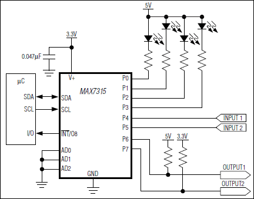

# MAX7315 I/O Expander

MAX7315 GPIO expander library with Arduino like API calls heavily based on PCA9534 library by Abdulrahman Saleh Khamis. It makes working with MAX7315 I/O expander pins easier, with familiar functions like `pinMode()`, `digitalWrite()` and `analogWrite()`. Refer to the [datasheet](https://datasheets.maximintegrated.com/en/ds/MAX7315.pdf) for more information about the chip.


## Usage



Connect an LED to MAX7315 pin 0 chip, add the MAX7315 library to your project and follow this simple example:

```Arduino
#include "MAX7315.h"

#define GPIO_PIN_LED 0

MAX7315 gpio;

void setup() {
  gpio.begin();
  gpio.pinMode(GPIO_PIN_LED, OUTPUT);
}

void loop() {
  gpio.digitalWrite(GPIO_PIN_LED, LOW); // LED On
  delay(500);
  gpio.digitalWrite(GPIO_PIN_LED, HIGH); // LED Off
  delay(500);
}
```

See the examples folder for more details.

## Documentation

### `MAX7315`
Creates a new MAX7315 class to manage a MAX7315 chip.

```Arduino
#include "MAX7315.h"
...
...
MAX7315 gpio;
...
...
void setup() {
  gpio.begin();
}
```

### `begin([i2caddr])`
Initializes the device and performs initial I2C setup. This method should be called before any others are used.

#### Parameters:
| Name | Type | Description |
|------|------|-------------|
| `i2caddr` | `uint8_t` | Sets the slave address of the MAX7315, defaults to 0x20. |

```Arduino
void setup() {
  gpio.begin(0x20);
}
```

### `pinMode(pin, mode)`
Configures the specified pin to behave either as an input, inverted input, or output.

#### Parameters:
| Name | Type | Description |
|------|------|-------------|
| `pin` | `uint8_t` | Pin number whose mode you wish to set. |
| `mode` | `uint8_t` | Pin mode one of: `INPUT`, `INPUT_INVERTED`, or `OUTPUT`. |

```Arduino
void setup() {
  gpio.begin();
  gpio.pinMode(0, OUTPUT);
}
```

### `digitalWrite(pin, value)`
Writes a `HIGH` or a `LOW` value to a digital pin.

#### Parameters:
| Name | Type | Description |
|------|------|-------------|
| `pin` | `uint8_t` | Pin number whose value you wish to set. |
| `value` | `uint8_t` | Pin value one of: `HIGH`, or `LOW`. |

```Arduino
void loop() {
  gpio.digitalWrite(0, LOW);
  delay(500);
  gpio.digitalWrite(0, HIGH);
  delay(500);
}
```

### `digitalRead(pin)`
Reads the value from a specified digital pin, either `HIGH` or `LOW`.

*Note: when using `INPUT_INVERTED` on `pinMode()`, you will get the inverted status.*

#### Parameters:
| Name | Type | Description |
|------|------|-------------|
| `pin` | `uint8_t` | Pin number whose value you wish to get. |

#### Returns:
`uint8_t` - The status of the pin either HIGH or LOW.

```Arduino
void loop() {
  uint8_t buttonStatus = gpio.digitalRead(1);
  if (buttonStatus == HIGH) {
    gpio.digitalWrite(0, LOW); // LED On
  } else {
    gpio.digitalWrite(0, HIGH); // LED Off
  }
}
```

## LICENSE
Original PCA9534 library - Copyright 2017 Abdulrahman Saleh Khamis

Licensed under the MIT license
